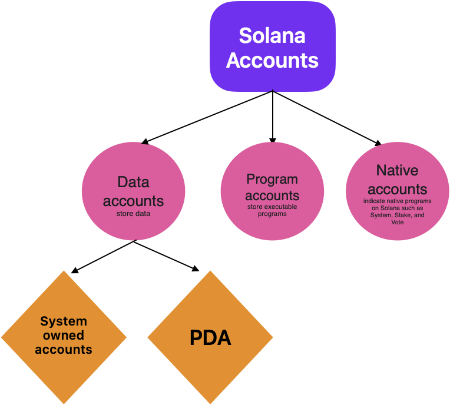
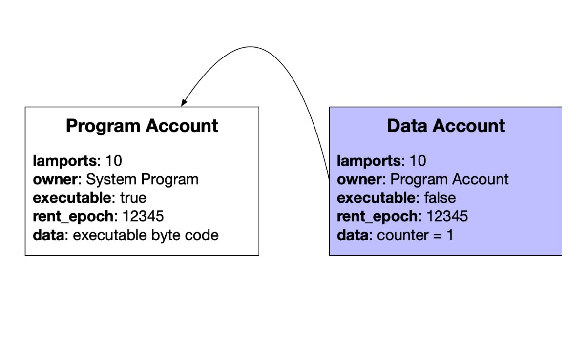
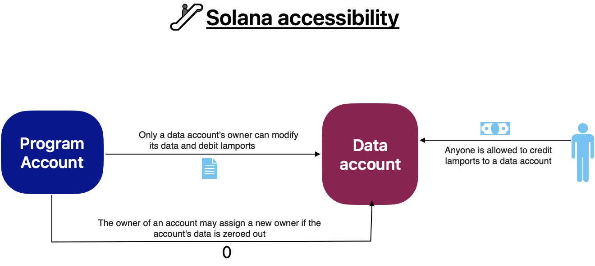

# Solana concepts

## About

- Consensus algorithm: Proof of History

## Terminology

- **Cluster**: A cluster is a network of validators that make up an instance of the Solana blockchain. Testnet, Devnet and Mainnet Beta are the clusters primarily recognized by the Solana community. Testnet and Devnet are used for testing and development. Mainnet Beta is the instance where tokens are recognized to have monetary value. But there is no reason other clusters could not exist.
- **Epoch**: Currently ~3 days. This period exists primarily to schedule validators but also times other events such as rent collection and rewards distribution.
- **Accounts**: An account is essentially a file with an address/id (pubkey) that lives on the Solana blockchain. If you need to store data on chain it gets stored in a data account (like EOSIO RAM). Accounts live in the RAM (part of hardware) of the validators in a network. An account must pay rent (see below) in order to persist on chain. Normally, it's for 2 years.

  

  Imagine a `Counter` program, it needs 2 accounts to work:
  

- **Accessibility**:
  
- **Sealevel**: The solana network runtime that enables the parallel execution of instructions and transactions. Though very different in ,implementation and modeling, it is equivalent to Ethereum VM (EVM).
- **Programs**: On Solana smart contracts are called programs. A program is just an account that has been marked executable. Once a program has been deployed on chain it can be read and interacted with via instructions (see below).
- **Program ID**: The public key of the program.
- **Account Ownership**: Accounts are owned by programs which are indicated by a Program id in the metadata “owner” field.
- **Native Programs**: “Special” programs that are required to run the network.
- **System Program**: The system program is responsible for creating new accounts, and assigning account ownership.
- **BPF Loader**: The BPF Loader program is responsible for deployment, upgrades and instruction execution of solana programs.
- There are other native programs but these are the more relevant programs for solana programming.
- **Token Programs**: A kind of program that implements a fungible or non fungible token other than the native $SOL token.
- **Associated Token Accounts**: If an account holds any token other than the native Solana token it will have an associated token account for each type of token it holds.
- **Instructions**: What is called in order to execute a function of a program.
- **Sysvar**: An account which enforces certain variables of the network such as epoch, rent, validator rewards, etc…
- **Rent** (like EOSIO RAM): The network charges rent (in $SOL) for data held in accounts, since this takes up validator network resources. An account can be exempt from rent collection if it has 2 years of rent in it’s balance. Rent is collected every epoch. If an account is unable to rent it will no longer load.
- **Program Derived Addresses (PDAs)**: PDAs enable the transfer of an account’s ownership from one program to another. This is useful for situations that require an escrow account such as auctions, DEXs, swaps, etc…
- **Cross Program Invocation**: Calling a program from another program. This is helpful for more complex on chain actions. Such as executing an instruction of an associated token account program during a token swap.
