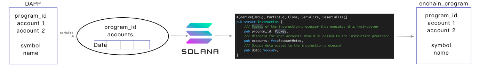

### Q. Which encryption is used in Solana?
ed25519 meaning `2^255 - 19`

### Q. Which hashing is used in Solana?
SHA256

### Q. How does a public key looks like?
8JKxV9WFUN828KsN2ka7ejHaNfxUMM5hdo7WuMGEtwMc

44 chars

### Q. How does a private key look like?
yiCUEF4v76inZBFXazYivLGsD33CUNiafA7yJAGGHbxjU52CuKGVr6WNGFivMhKmvA1bs8gtQsToSLCQAde4ysp

87 chars

### Q. How does a transaction hash/signature look like?
5DTMVt3jN5dbxsbkWQESKq5MvZemFdL2LyfhW6VA5VUgEt95h218kTh2gECKTMkVQpSpEEsmW2Vba3w1MC3APMYn

88 chars

### Q. What is the difference between public key & address?
Both are same

### What are the different types of wallets?
1. App wallet
2. Web wallet
3. CLI wallet

### Q. Which output file is running in Solana?
BPF (usually with `.so` as extension): BPF file of ELF format

It is compiled from C, Rust or other programming languages. 

The BPF file(usually with `.so` as extension) needs to be deployed to Solana validator, and executed through Solana runtime.

### Q. Which program representation file type is used in Solana?
IDL - Interface Description Language.

### Q. How to generate BPF bytecode?
Normally, LLVM can compile C, Rust code to BPF bytecode.

### Q. What is a Solana transaction? How is it executed?
A Solana transaction contains multiple instructions.

> `Action` (in EOS) <--> `Instruction` (in Solana)

A transaction may contain multiple __instructions__. Once a node has received a transaction, it will parse the instructions, and call related __on-chain programs__ according to __program_id__ param passed by every instruction.

### Q. What is a Solana instruction? How is it executed?
Instruction is the minimum unit that a Solana node to execute:



Dapp send serialized program params and account info to Solana node, Solana node find the related on-chain programs and send the data to the program, then the program deserialize it and execute the command using the params.

### Q. What is Solana account? How is it executed?
Every Solana account/program has these on-chain resources: __RAM__, __file__, __CPU(Compute budget)__, etc.

> In EOS, there is no limit set for RAM, CPU (network compute time), NET (network bandwidth).

In Solana, each program has a finite limit of on-chain resources:

- Stack size: __4 MB__
- CPU time: __200,000 BPF__
- Stack depth: __64__

Hence, there is no case possible, where programs have competing resources.

Every piece of information saved on-chain is a file (account & file are same). So, people need to pay SOL for the space of the file.

 If you want to close a file, you just transfer all the SOL of this file out, since there is no fee to pay the space of this file.
 
### Q. What is the difference b/w account & program & file?
Account & file has public-private key pair, whereas a program has only id and is executable.

### Q. Why BPF & not WASM?
BPF consumes less resources than WASM, hence more performant.

### Q. What is contract called in Solana?
Program

### Q. What is EOA (in Ethereum) called in Solana?
Account

### Q. Does data & code stored in programs in Solana?
No.

Code and data is stored separately.

### Q. What is the difference b/w cluster & node?
A cluster is a network like mainnet, testnet, devnet, localnet whereas a node is a part of a cluster.

### Q. Where the data is stored?
In the accounts owned by a program.

### Q. Who creates this account required for storing data?
Program creates it an account like this in `initialize` function of a program:

```
...
		#[account(init, payer = user, space = 16 + 16)]
		pub vote_account: Account<'info, VoteAccount>,

...
```

The program owns these accounts. This leads to less boilerplate and less code to reason about.


### Q. Where the code is stored?
In the programs.

Programs need to fetch the data from an account, then it is mentioned like this:

```
#[account]
pub struct VoteAccount {
		pub crunchy: u64,
		pub smooth: u64,
}
```


### Q. Does the data persistence cost?
Yes.

Every account has to give rent or give rent for worth of 2 years. Everyone gives the 2 years of rent. In this way, the account is exempted from rent.

### Q. Is the account owned by anyone?
Yes, by the system program (by default). 

### Q. How many times accounts can be assigned to a new owner?
Only once.

### Q. How does the Solana account address look like?
ed25519 pubkeys and the corresponding privkey is retained by the user for signatures.

### Q. Which model is followed in Solana?
Program/Account model.

Pros:

- Unlike on EVM, EOSIO blockchains, here one doesn't need to deploy code to create a new token. Rather this is taken care by the 'spl token program'. These is followed:
	+ you create an account that can mint tokens, and more accounts that can receive them.
	+ the mint address uniquely determines the token type, and these are all passed as arguments to one static program instance

### Q. What are the functions called here?
Instruction (in Solana) <--> Method (in EVM) <--> Action (in EOSIO)

multiple instructions can be bundled into a __message__ called "__transaction__".

### Q. What is the replacement of `nonce` here?
`blockhash`. Every message contains this.

### Q. When the `solana-test-validator` command is used, then where exacty the validator's info is stored?
It is stored in a file in the folder named `test-ledger/` of current directory the terminal opened at. It looks like this:

```
.
├── accounts
│   ├── 0.0
│   ├── 0.1
│   ├── 0.2
│   ├── 0.3
│   ├── 0.38
│   ├── 0.4
│   ├── 1.5
│   ├── 10.14
│   ├── 10.56
│   ├── 100.171
│   ├── 100.237
│   ├── 11.58
│   ├── 99.168
│   └── 99.239
├── admin.rpc
├── faucet-keypair.json
├── genesis.bin
├── genesis.tar.bz2
├── ledger.lock
├── rocksdb
│   ├── 000077.sst
│   ├── 000078.sst
│   ├── 000079.sst
│   ├── 000080.sst
│   ├── 000081.sst
│   ├── 000082.sst
│   ├── 000083.sst
│   ├── 000085.log
│   ├── CURRENT
│   ├── IDENTITY
│   ├── LOCK
│   ├── LOG
│   ├── LOG.old.1638423285952250
│   ├── MANIFEST-000084
│   ├── OPTIONS-000117
│   └── OPTIONS-000119
├── snapshot
│   └── 100
│       └── 100
├── snapshot-100-F8SWyJ3qoE4soxNHLfbExwhpzBegXN7R5qLvZaGuSkhR.tar
├── tower-AzGBwL6WRyjbZc5AjLqN3WaMFxKDWFE92zZu5mFedLfQ.bin
├── validator-1638423285664.log
├── validator-keypair.json
├── validator.log -> validator-1638423285664.log
└── vote-account-keypair.json

4 directories, 325 files
```

### Q. What is the lowest unit of SOL?
_lamport_

1 SOL = 1e9 lamport

### Q. What is meant by account ownership?
In Solana, account ownership can only be done by a program/contract.

### Q. What is account holder?
In Solana, account holder is mainly referred to a human who own the private key of the account.

### Q. What is rent charged for?
The Solana network charges rent for time & space based storage into their memory (RAM). Each account can have owner-controlled state (`Account::data`) that's separate from the account's balance (`Account::lamports`).

Accounts which maintain a 2-year worth of lamports, are exempted from transaction fee.

### Q. What are the 2 types of charging transaction fee?
1. Set it and forget it
1. Pay per byte

The rent is generally in `lamports per KB-year`.

### Q. What is `runtime`?
Here, we can compute budget for a program in this way:

```
pub struct BpfComputeBudget {
    /// Number of compute units that an instruction is allowed.  Compute units
    /// are consumed by program execution, resources they use, etc...
    pub max_units: u64,
    /// Number of compute units consumed by a log call
    pub log_units: u64,
    /// Number of compute units consumed by a log_u64 call
    pub log_64_units: u64,
    /// Number of compute units consumed by a create_program_address call
    pub create_program_address_units: u64,
    /// Number of compute units consumed by an invoke call (not including the cost incurred by
    /// the called program)
    pub invoke_units: u64,
    /// Maximum cross-program invocation depth allowed including the original caller
    pub max_invoke_depth: usize,
    /// Base number of compute units consumed to call SHA256
    pub sha256_base_cost: u64,
    /// Incremental number of units consumed by SHA256 (based on bytes)
    pub sha256_byte_cost: u64,
    /// Maximum BPF to BPF call depth
    pub max_call_depth: usize,
    /// Size of a stack frame in bytes, must match the size specified in the LLVM BPF backend
    pub stack_frame_size: usize,
    /// Number of compute units consumed by logging a `Pubkey`
    pub log_pubkey_units: u64,
}
```

### Q. What is `Pubkey`?
It represents an account address of _Base58_ format, also in __Instruction__ the __ProgramId__ is also of the same format.

```
#[repr(transparent)]
#[derive(
    Serialize, Deserialize, Clone, Copy, Default, Eq, PartialEq, Ord, PartialOrd, Hash, AbiExample,
)]
pub struct Pubkey([u8; 32]);]
```

### Q. What is `AccountInfo`?
It gives account information

```
/// Account information
#[derive(Clone)]
pub struct AccountInfo<'a> {
    /// Public key of the account
    pub key: &'a Pubkey,
    /// Was the transaction signed by this account's public key?
    pub is_signer: bool,
    /// Is the account writable?
    pub is_writable: bool,
    /// The lamports in the account.  Modifiable by programs.
    pub lamports: Rc<RefCell<&'a mut u64>>,
    /// The data held in this account.  Modifiable by programs.
    pub data: Rc<RefCell<&'a mut [u8]>>,
    /// Program that owns this account
    pub owner: &'a Pubkey,
    /// This account's data contains a loaded program (and is now read-only)
    pub executable: bool,
    /// The epoch at which this account will next owe rent
    pub rent_epoch: Epoch,
}
```

Here,
- `key` is the id of this file, which is base-58 address.
- `lamports` represents the rent fee for the space of the file, so lamports cannot be `0`, `0` means the file is closed.
- `is_writable` represents this is a executable file(program) or a normal account.
- `data` stores the content of the file which is buffer of binary data. Every file/account is created by program, which called __owner__.

### Q. What is `ProgramResult`?
`ProgramResult` is a Result of type `ProgramError` which is defined as an enum of errors thrown by runtime. If a program runs well, we call `Ok()` to get the right result, if there is something wrong，We return `ProgramError`.

```
/// Reasons the program may fail
#[derive(Clone, Debug, Deserialize, Eq, Error, PartialEq, Serialize)]
pub enum ProgramError {
    /// Allows on-chain programs to implement program-specific error types and see them returned
    /// by the Solana runtime. A program-specific error may be any type that is represented as
    /// or serialized to a u32 integer.
    #[error("Custom program error: {0:#x}")]
    Custom(u32)
    ...
}use std::{
    result::Result as ResultGeneric,
};
pub type ProgramResult = ResultGeneric<(), ProgramError>;
```

### Q. What is `AccountMeta`?
`AccountMeta` is mainly used in `Instruction`, passing in information like iaccount address, whether this account is a signer, and whether its content is writable.

```
/// Account metadata used to define Instructions
#[derive(Debug, PartialEq, Clone, Serialize, Deserialize)]
pub struct AccountMeta {
    /// An account's public key
    pub pubkey: Pubkey,
    /// True if an Instruction requires a Transaction signature matching `pubkey`.
    pub is_signer: bool,
    /// True if the `pubkey` can be loaded as a read-write account.
    pub is_writable: bool,
}
```

### Q. What is `Instruction`?
Only the related program know how to serialize the data, so even we intercept the instruction, it would be very hard to see what does it do.

```
#[derive(Debug, PartialEq, Clone, Serialize, Deserialize)]
pub struct Instruction {
    /// Pubkey of the instruction processor that executes this instruction
    pub program_id: Pubkey,
    /// Metadata for what accounts should be passed to the instruction processor
    pub accounts: Vec<AccountMeta>,
    /// Opaque data passed to the instruction processor
    pub data: Vec<u8>,
}
```