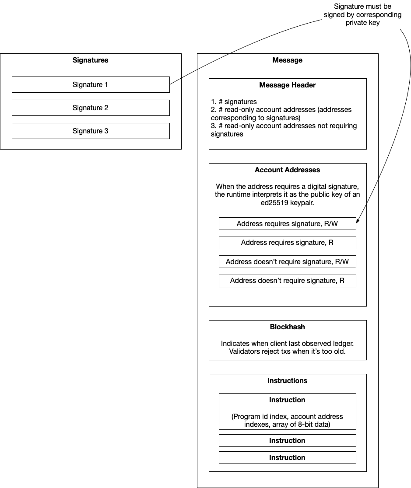

### Q. What is block time in Solana?
0.4s (accurate 0.46s)

### Q. Which encryption is used in Solana?
ed25519 meaning `2^255 - 19`

### Q. Which hashing is used in Solana?
SHA256

### Q. How does a public key looks like?
`8JKxV9WFUN828KsN2ka7ejHaNfxUMM5hdo7WuMGEtwMc` (44 chars)

ranges from 32 to 44 chars

32 chars - `snip_32_chars(SHA256(public_key)`

`base58` encoded.

### Q. How does a private key look like?
`yiCUEF4v76inZBFXazYivLGsD33CUNiafA7yJAGGHbxjU52CuKGVr6WNGFivMhKmvA1bs8gtQsToSLCQAde4ysp`

87 chars

### Q. How does a transaction hash/signature look like?
`5DTMVt3jN5dbxsbkWQESKq5MvZemFdL2LyfhW6VA5VUgEt95h218kTh2gECKTMkVQpSpEEsmW2Vba3w1MC3APMYn`

88 chars

### Q. What a transaction contains?
It contains:

1. __Signatures__: array of signatures to get permissions within a transaction. E.g. sending tokens. Unlike Ethereum, it contains many signers (if present).
2. __Metadata__ contains list of accounts that will be referenced/used in this transaction and a “recent” block hash.
  - message:
    + header which includes 3 `uint8`s (account who will sign the payload, account of read-only addresses that require signatures, account of read-only addresses that do not require signatures). Used as metadata internally during runtime to check permissions.
  - array of account addresses: the accounts which are accessed
  - previous block hash
3. __Instruction__: contains 3 pieces of data:
  - set of accounts used whether signer or writeable,
  - program ID which references the location of code being called,
  - a buffer with some data in it, which functions as calldata

[Source](https://medium.com/@asmiller1989/solana-transactions-in-depth-1f7f7fe06ac2)

> NOTE: Some account addresses don’t require signatures. For example, a program might enforce that only a certain account can increment a counter, in which case the account’s address would require a signature. On the other hand, a program could let anyone read/write anything, in which case no signature would be required. For more on this, see the Anchor docs.



### Q. What is the difference between public key & address?
In Solana, both are same, unlike in EVM chains, where address is a `snip_last_20bytes(SHA256(public_key))`.

### What are the different types of wallets?
1. App wallet
2. Web wallet
3. CLI wallet

### Q. What is a Solana program?
A __program__ is to Solana what a __smart contract__ is to other protocols. Once a program has been deployed, any app can interact with it by sending a transaction containing the program instructions to a Solana cluster, which will pass it to the program to be run.

> Solana programs are stateless. To store values we must use a separate account.
> In Ethereum, contract accounts store code, but they also store state (which the code can read/write). In Solana, a program account ONLY stores code, and its state is stored in one or more data accounts. In other words, if you are a Solana smart contract developer and you want to store some data, you first need to deploy the program account, and then create one or more data accounts to store data associated with the program.

### Q. What is a Solana account holder?
It's like any EOA in EVM chains which has a public & private key pair.

> NOTE: It's different than PDA.

Solana account is represented by a public key which can be either of these types:

- an ed25519 public key
- a program-derived account address (32-byte value forced off the ed25519 curve)
- a hash of an ed25519 public key with a 32 character string

### Q. What does a Solana account contain?

> NOTE: a program is also an account

These are the data:

* `lamports`: The number of lamports owner by this account
* `owner`: The program owner of this account
* `executable`: Whether this account can process instructions
* `data`: The raw data byte array stored by this account
* `rent_epoch`: The next epoch that this account will owe rent

### Q. What is a Solana PDA?
"Program Derived Account" is an account whose owner is a program and thus is not controlled by a private key like other accounts.

> Usually, account addresses are usually the public key of a keypair. A program derived address is NOT a public key, and thus has no associated private key. Note that every account has an owner that’s a program, so that part of the definition is a bit redundant.

A PDA also serves as _input_ & _output_ of a program. In other words, on-chain state is represented by accounts. If a program wants to modify on-chain state, it modifies an account (or multiple accounts).

### Q. What is the Solana VM called?
Sealevel, like EVM in Ethereum, BSC, Polygon,..

### Q. Which programming languages is supported for writing Solana smart contract?
1. Rust (mostly used)
2. C
3. C++

### How much is the estimated transaction fees?
10 USD for 1 M transactions.

### Q. Which output file is running in Solana?
BPF (usually with `.so` as extension): BPF file of ELF format

It is compiled from C, Rust or other programming languages. 

The BPF file(usually with `.so` as extension) needs to be deployed to Solana validator, and executed through Solana runtime.

### Q. Which program representation file type is used in Solana?
IDL - Interface Description Language.

If you've developed on Ethereum, the `IDL` is analogous to the `abi.json`.

### Q. How to generate BPF bytecode?
Normally, LLVM can compile C, Rust code to BPF bytecode.

### Q. What is a Solana transaction? How is it executed?
A Solana transaction contains multiple instructions.

> `Action` (in EOS) <--> `Instruction` (in Solana)

A transaction may contain multiple __instructions__. Once a node has received a transaction, it will parse the instructions, and call related __on-chain programs__ according to __program_id__ param passed by every instruction.

### Q. What is a Solana instruction? How is it executed?
Instruction is the minimum unit that a Solana node to execute:


Dapp send serialized program params and account info to Solana node, Solana node find the related on-chain programs and send the data to the program, then the program deserialize it and execute the command using the params.

> NOTE: if one of the instructions fails, then the whole transaction gets reverted. Same as EOSIO.

### Q. What is Solana account? How is it executed?
Every Solana account/program has these on-chain resources: __RAM__, __file__, __CPU(Compute budget)__, etc.

> In EOS, there is no limit set for an account in terms of RAM, CPU (network compute time), NET (network bandwidth).

In Solana, each program has a finite limit of on-chain resources:

- Stack size: __4 MB__
- CPU time: __200,000 BPF__
- Stack depth: __64__

Hence, there is no case possible, where programs have competing resources.

Every piece of information saved on-chain is a file (account & file are same). So, people need to pay SOL for the space of the file.

If you want to close a file, you just transfer all the SOL of this file out, since there is no fee to pay the space of this file.
 
### Q. What is the difference b/w account & program & file?
Account & file has public-private key pair, whereas a program has only id and is executable.

### Q. Why BPF & not WASM?
BPF consumes less resources than WASM, hence more performant.

### Q. What is contract called in Solana?
Program

### Q. What is EOA (in Ethereum) called in Solana?
Account

### Q. Does data & code stored in programs in Solana?
No.

Code and data is stored separately.

### Q. What is the difference b/w cluster & node?
A cluster is a network like mainnet, testnet, devnet, localnet whereas a node is a part of a cluster.

### Q. Where the data is stored?
In the accounts owned by a program.

### Q. Who creates this account required for storing data?
Program creates it an account like this in `initialize` function of a program:

```
...
		#[account(init, payer = user, space = 16 + 16)]
		pub vote_account: Account<'info, VoteAccount>,

...
```

The program owns these accounts. This leads to less boilerplate and less code to reason about.


### Q. Where the code is stored?
In the programs.

Programs need to fetch the data from an account, hence it is mentioned like this:

```
#[account]
pub struct VoteAccount {
		pub crunchy: u64,
		pub smooth: u64,
}
```


### Q. Does the data persistence cost?
Yes.

Every account has to give rent or give rent for worth of 2 years. Everyone gives the 2 years of rent. In this way, the account is exempted from rent.

### Q. Is the account owned by anyone?
Yes, by the system program (by default). 

### Q. How many times accounts can be assigned to a new owner?
Only once.

### Q. How does the Solana account address look like?
ed25519 pubkeys and the corresponding privkey is retained by the user for signatures.

### Q. Which model is followed in Solana?
Program/Account model.

Pros:

- Unlike on EVM, EOSIO blockchains, here one doesn't need to deploy code to create a new token. Rather this is taken care by the 'spl token program'. These is followed:
	+ you create an account that can mint tokens, and more accounts that can receive them.
	+ the mint address uniquely determines the token type, and these are all passed as arguments to one static program instance

### Q. What are the functions called here?
Instruction (in Solana) <--> Method (in EVM) <--> Action (in EOSIO)

multiple instructions can be bundled into a __message__ called "__transaction__".

### Q. What is the replacement of `nonce` here?
`blockhash`. Every message contains this.

> NOTE: In EOSIO also, there is no nonce, but a corresponding blockhash.

### Q. When the `solana-test-validator` command is used, then where exacty the validator's info is stored?
It is stored in a file in the folder named `test-ledger/` of current directory the terminal opened at. It looks like this:

```
.
├── accounts
│   ├── 0.0
│   ├── 0.1
│   ├── 0.2
│   ├── 0.3
│   ├── 0.38
│   ├── 0.4
│   ├── 1.5
│   ├── 10.14
│   ├── 10.56
│   ├── 100.171
│   ├── 100.237
│   ├── 11.58
│   ├── 99.168
│   └── 99.239
├── admin.rpc
├── faucet-keypair.json
├── genesis.bin
├── genesis.tar.bz2
├── ledger.lock
├── rocksdb
│   ├── 000077.sst
│   ├── 000078.sst
│   ├── 000079.sst
│   ├── 000080.sst
│   ├── 000081.sst
│   ├── 000082.sst
│   ├── 000083.sst
│   ├── 000085.log
│   ├── CURRENT
│   ├── IDENTITY
│   ├── LOCK
│   ├── LOG
│   ├── LOG.old.1638423285952250
│   ├── MANIFEST-000084
│   ├── OPTIONS-000117
│   └── OPTIONS-000119
├── snapshot
│   └── 100
│       └── 100
├── snapshot-100-F8SWyJ3qoE4soxNHLfbExwhpzBegXN7R5qLvZaGuSkhR.tar
├── tower-AzGBwL6WRyjbZc5AjLqN3WaMFxKDWFE92zZu5mFedLfQ.bin
├── validator-1638423285664.log
├── validator-keypair.json
├── validator.log -> validator-1638423285664.log
└── vote-account-keypair.json

4 directories, 325 files
```

### Q. What is the lowest unit of SOL?
_lamport_

`1 SOL = 1e9 lamport` i.e. 1 Billion

### Q. What is meant by account ownership?
In Solana, account ownership can only be done by a program/contract.

### Q. What is account holder?
In Solana, account holder is mainly referred to a human who own the private key of the account.

account holder (on Solana) <--> EOA (on EVM chains)

### Q. What is rent charged for?
The Solana network charges rent for time (i.e. how long stored?) & space (i.e. how much stored?) based storage into their memory (RAM). Each account can have owner-controlled state (`Account::data`) that's separate from the account's balance (`Account::lamports`).

Accounts which maintain a 2-year worth of lamports, are exempted from transaction fee.

### Q. What are the 2 types of charging transaction fee?
1. Set it and forget it
1. Pay per byte

The rent is generally in `lamports per KB-year`.

- `KB` is the _space_ here.
- `year` is the _time_ here.

### Q. What is `runtime`?
Here, we can compute budget for a program in this way:

```
pub struct BpfComputeBudget {
    /// Number of compute units that an instruction is allowed.  Compute units
    /// are consumed by program execution, resources they use, etc...
    pub max_units: u64,
    /// Number of compute units consumed by a log call
    pub log_units: u64,
    /// Number of compute units consumed by a log_u64 call
    pub log_64_units: u64,
    /// Number of compute units consumed by a create_program_address call
    pub create_program_address_units: u64,
    /// Number of compute units consumed by an invoke call (not including the cost incurred by
    /// the called program)
    pub invoke_units: u64,
    /// Maximum cross-program invocation depth allowed including the original caller
    pub max_invoke_depth: usize,
    /// Base number of compute units consumed to call SHA256
    pub sha256_base_cost: u64,
    /// Incremental number of units consumed by SHA256 (based on bytes)
    pub sha256_byte_cost: u64,
    /// Maximum BPF to BPF call depth
    pub max_call_depth: usize,
    /// Size of a stack frame in bytes, must match the size specified in the LLVM BPF backend
    pub stack_frame_size: usize,
    /// Number of compute units consumed by logging a `Pubkey`
    pub log_pubkey_units: u64,
}
```

### Q. What is `Pubkey`?
It represents an account address of _Base58_ format, also in __Instruction__ the __ProgramId__ is also of the same format.

```
#[repr(transparent)]
#[derive(
    Serialize, Deserialize, Clone, Copy, Default, Eq, PartialEq, Ord, PartialOrd, Hash, AbiExample,
)]
pub struct Pubkey([u8; 32]);]
```

### Q. What is `AccountInfo`?
It gives account information

```
/// Account information
#[derive(Clone)]
pub struct AccountInfo<'a> {
    /// Public key of the account
    pub key: &'a Pubkey,
    /// Was the transaction signed by this account's public key?
    pub is_signer: bool,
    /// Is the account writable?
    pub is_writable: bool,
    /// The lamports in the account.  Modifiable by programs.
    pub lamports: Rc<RefCell<&'a mut u64>>,
    /// The data held in this account.  Modifiable by programs.
    pub data: Rc<RefCell<&'a mut [u8]>>,
    /// Program that owns this account
    pub owner: &'a Pubkey,
    /// This account's data contains a loaded program (and is now read-only)
    pub executable: bool,
    /// The epoch at which this account will next owe rent
    pub rent_epoch: Epoch,
}
```

Here,
- `key` is the id of this file, which is base-58 address.
- `lamports` represents the rent fee for the space of the file, so lamports cannot be `0`, `0` means the file is closed.
- `is_writable` represents this is a executable file(program) or a normal account.
- `data` stores the content of the file which is buffer of binary data. Every file/account is created by program, which called __owner__.

### Q. What is `ProgramResult`?
`ProgramResult` is a Result of type `ProgramError` which is defined as an enum of errors thrown by runtime. If a program runs well, we call `Ok()` to get the right result, if there is something wrong，We return `ProgramError`.

```
/// Reasons the program may fail
#[derive(Clone, Debug, Deserialize, Eq, Error, PartialEq, Serialize)]
pub enum ProgramError {
    /// Allows on-chain programs to implement program-specific error types and see them returned
    /// by the Solana runtime. A program-specific error may be any type that is represented as
    /// or serialized to a u32 integer.
    #[error("Custom program error: {0:#x}")]
    Custom(u32)
    ...
}use std::{
    result::Result as ResultGeneric,
};
pub type ProgramResult = ResultGeneric<(), ProgramError>;
```

### Q. What is `AccountMeta`?
`AccountMeta` is mainly used in `Instruction`, passing in information like iaccount address, whether this account is a signer, and whether its content is writable.

```
/// Account metadata used to define Instructions
#[derive(Debug, PartialEq, Clone, Serialize, Deserialize)]
pub struct AccountMeta {
    /// An account's public key
    pub pubkey: Pubkey,
    /// True if an Instruction requires a Transaction signature matching `pubkey`.
    pub is_signer: bool,
    /// True if the `pubkey` can be loaded as a read-write account.
    pub is_writable: bool,
}
```

### Q. What is `Instruction`?
Only the related program know how to serialize the data, so even we intercept the instruction, it would be very hard to see what does it do.

```
#[derive(Debug, PartialEq, Clone, Serialize, Deserialize)]
pub struct Instruction {
    /// Pubkey of the instruction processor that executes this instruction
    pub program_id: Pubkey,
    /// Metadata for what accounts should be passed to the instruction processor
    pub accounts: Vec<AccountMeta>,
    /// Opaque data passed to the instruction processor
    pub data: Vec<u8>,
}
```

### Q. Why use Anchor in writing solana programs?

| Solana | Anchor |
|--|--|
| Solana program architecture uses `Entrypoint`, `State`, `Processor`, `Instruction`, `Lib` and `Error` files. So, these are taken care of `Anchor` | Anchor has modules, modules are basically a way of grouping structs, functions, methods etc in a large program to make it more easier to export and reuse |
| used `BorshSerialize` and `BorshDeserialize` traits from the `Borsh` crate | 4 traits AccountSerialize, Account Deserialise, AnchorSerialize and AnchorDeserialize which are just modified versions of Borsh traits. |

### Q. How to identify the owner of a PDA?
In order to differentiate which account is used as storage for which program, each account has an owner field.

> NOTE:
> - Any solana program can read data of an un-owned solana PDA.
> - But, only the owner (solana program) can modify the data of owned solana PDA.
> - This contrasts with the EVM where a smart contract cannot read the storage of another contract, the contract must expose a `public` api for reading storage information that may be useful.

### Q. What are the native programs on Solana?
Following is a list of native Solana programs with their corresponding program_ids:

- system_program (Program id: `11111111111111111111111111111111`)
- stake (Program id: `Stake11111111111111111111111111111111111111`)
- vote (Program id: `Vote111111111111111111111111111111111111111`)
- config (Program id: `Config1111111111111111111111111111111111111`)
- BPFLoaderUpgradeab1e (Program id: `BPFLoaderUpgradeab1e11111111111111111111111`)
- Ed25519 (Program id: `Ed25519SigVerify111111111111111111111111111`)
- Secp256k1 (Program id: `KeccakSecp256k11111111111111111111111111111`)
- spl_token (Program id: `TokenkegQfeZyiNwAJbNbGKPFXCWuBvf9Ss623VQ5DA`)
- spl_associated_token_account (Program id: `ATokenGPvbdGVxr1b2hvZbsiqW5xWH25efTNsLJA8knL`)

### Q. How to invoke cross program?
2 ways of invoking cross programs:

A. without signature i.e. `solana_program::program::invoke`

```rs
pub fn invoke(
    instruction: &Instruction,
    account_infos: &[AccountInfo<'_>]
) -> ProgramResult
```

B. with signature i.e. `solana_program::program::invoke_signed`
```rs
pub fn invoke_signed(
    instruction: &Instruction,
    account_infos: &[AccountInfo<'_>]
    signers_seeds: &[&[&[u8]]]
) -> ProgramResult
```

> Note: internally, invoke calls invoke_signed without signer_seeds.

Now, `Instruction` is defined as:
```
pub struct Instruction {
    pub program_id: Pubkey,
    pub accounts: Vec<Metadata>,
    pub data: Vec<u8>,
}
```

Now, `invoke` or `invoke_signed` after implementing _RefCell_ check is written as:
```rs
pub fn invoke(
    instruction: &Instruction,
    account_infos: &[AccountInfo<'_>],
) -> ProgramResult {
    // Check that the account RefCells are consistent with the request
    for account_meta: &AccountMeta in instruction.accounts.iter() {
        for account_info: &AccountInfo in account_infos.iter() {
            if account_meta.pubkey == *account_info.key {
                let _ = account_info.try_borrow_mut_lamports()?;
                let _ = account_info.try_borrow_mut_data()?;
            } else {
                let _ = account_info.try_borrow_lamports()?;
                let _ = account_info.try_borrow_data()?;
            }

            break;
        }
    }
}
```

> The RefCell checking can be compute unit expensive due to nested loops.

> To avoid that expense, dapps may choose to use `invoke_unchecked` and `invoke_signed_unchecked`, the unchecked version of invoke and invoke_signed respectively, which do not check RefCells.

> However, use `invoke_unchecked` and `invoke_signed_unchecked` at your own risk: only when you are certain that the accounts used in instruction are consistent with those in the account_infos.

### Q. When a program is invoked in a cross program invokation, who gives the permission?
Program owner.

> Every account including programs has an owner. When a solana program is invoked, its owner is used to process the instruction (`invoke` or `invoke_signed`)

> For solana programs, their owners are either the [native loader](https://explorer.solana.com/address/NativeLoader1111111111111111111111111111111) or [BPF loader](https://explorer.solana.com/address/BPFLoader2111111111111111111111111111111111).

### Q. What is a native loader?
The native loader (`NativeLoader1111111111111111111111111111111`) is a special program that is the owner of most native Solana programs (those program_ids ended with `111111111111111111111111111`).

The native loader is also the owner of three BPF loaders:

* `[BPFLoaderUpgradeab1e](https://explorer.solana.com/address/BPFLoaderUpgradeab1e11111111111111111111111)` (the upgradeable Solana BPF loader. The upgradeable BPF loader is responsible for deploying, upgrading, and executing BPF programs.)
* `[BPFLoader2](https://explorer.solana.com/address/BPFLoader2111111111111111111111111111111111)` (The latest Solana BPF loader. The BPF loader is responsible for loading, finalizing, and executing BPF programs.)
* `[BPFLoader](https://explorer.solana.com/address/BPFLoader1111111111111111111111111111111111)` (The original and now deprecated Solana BPF loader)

### Q. What is `BPFLoaderUpgradeable` & `BPFLoader`?
* The programs which are upgradeable use Upgradeable BPF Loader to deploy the program, so their owner is `BPFLoaderUpgradeab1e` and they can be upgraded by an upgrade authority set at the program deployment time.

* The programs which are immutable use `BPFLoader2` or `BPFLoader` to deploy. E.g. `spl_token`, `spl_associated_token` are loaded by this.

### Q. What is a system program?
* [account details](https://explorer.solana.com/address/11111111111111111111111111111111) on mainnet.
* It contains this [code](https://github.com/solana-labs/solana/blob/master/runtime/src/system_instruction_processor.rs).
* It is the most frequently invoked program.
* Used for:
  - create new accounts
  - allocate account data
  - assign accounts to owning programs
  - transfer lamports from System Program owned accounts
  - pay transaction fees.
* It is the _owner_ of all wallet accounts.

> Note: only the owner of an account has write access to the account. If an account is not owned by a program, the program is only permitted to read its data and credit the account (but not debit the account).

> The System Program is also the _default owner_ of an account when the account is created by `create_account`. It is then allowed to transfer lamports and importantly _assign_ account ownership, i.e., changing owner to a different program id.

### Q. What is a spl_token?
* It provides functions for creating and managing tokens (including both fungible and non-fungible tokens, i.e. NFTs).
* [account details](https://explorer.solana.com/address/TokenkegQfeZyiNwAJbNbGKPFXCWuBvf9Ss623VQ5DA) on mainnet.
* It contains this [code](https://github.com/solana-labs/solana-program-library/blob/master/token/program/src/instruction.rs).
* `spl_token` is commonly used to create new tokens, mint, burn, and distribute to users. The following instructions are frequently used in Solana smart contracts:
* Create a token account
`spl_token::instruction::initialize_account`
* Create a token mint
`spl_token::instruction::initialize_mint`
* Mint new tokens to an account
`spl_token::instruction::mint_to`
* Transfers tokens from one account to another
`spl_token::instruction::transfer`
* Burns tokens by removing them from an account
`spl_token::instruction::burn`
* Approves a delegate
`spl_token::instruction::approve`

### Q. What is a spl associated token?
* It allows a user to create a main token account for each token they own. Internally, it maps the user's wallet address to a unique associated token account for each token mint.
* [account details](https://explorer.solana.com/address/ATokenGPvbdGVxr1b2hvZbsiqW5xWH25efTNsLJA8knL) on mainnet.
* It contains this [code](https://github.com/solana-labs/solana-program-library/blob/master/associated-token-account/program/src/lib.rs).
* Specifically, to create an associated token for the given wallet address and token mint, use `create_associated_token_account`

### Q. What is a stake program?
* The Stake Program is used to create and manage accounts representing stake and rewards for validators or their delegators.
* [account details](https://explorer.solana.com/address/Stake11111111111111111111111111111111111111) on mainnet.
* It contains this [code](https://github.com/solana-labs/solana/blob/master/programs/stake/src/stake_instruction.rs).
* Initialize a stake with lockup and authorization information `stake::instruction::initialize`
* Authorize a key to manage stake or withdrawal
`stake::instruction::authorize`
* Withdraw unstaked lamports from the stake account
`stake::instruction::withdraw`
* Set stake lockup
`stake::instruction::set_lockup`
* Deactivates the stake in the account
`stake::instruction::deactivate_stake`
* Merge two stake accounts
`stake::instruction::merge`
* Split stake off a stake account into another stake account
`stake::instruction::split`
* Delegate a stake to a particular vote account
`stake::instruction::delegate_stake`

### Q. What is a vote program?
* The Vote Program is used to create and manage accounts that track validator voting state and rewards.
* [account details](https://explorer.solana.com/address/Vote111111111111111111111111111111111111111) on mainnet.
* It contains this [code](https://github.com/solana-labs/solana/blob/master/programs/vote/src/vote_instruction.rs).

### Q. What is a config program?
* The Config Program is used to add configuration data to the chain including the list of public keys that are permitted to modify the data.

> `vote` and `config` are primarily used by Solana validators, so we omit details here.

* [account details](https://explorer.solana.com/address/Config1111111111111111111111111111111111111) on mainnet.
* It contains this [code](https://github.com/solana-labs/solana/blob/master/programs/config/src/config_instruction.rs).

### Q. What is a ed25519 program?
* The Ed25519 Signature Verify Program takes an ed25519 signature, public key, and message, and is used to verify if the message is signed by the (corresponding secret) private key.
* [account details](https://explorer.solana.com/address/Ed25519SigVerify111111111111111111111111111) on mainnet.
* It contains this [code](https://github.com/solana-labs/solana/blob/master/core/src/sigverify.rs).
* By default, signatures are verified in parallel using all available CPU cores. When perf-libs are available signature verification is offloaded to the GPU.
* Multiple signatures can be verified. If any of the signatures fail to verify, an error is returned.

### Q. What is a secp256k1 program?
* The Secp256k1 Recover Program is used to recover Secp256k1 public key from a signed message (ecrecover). It is added to support Ethereum / Solana bridge.
* Secp256k1 is the name of the elliptic curve used by popular blockchains (e.g., Bitcoin, Ethereum) to implement public key cryptography. All points on this curve are valid public keys.
* Both Ed25519 and Secp256k1 programs are precompiled in Solana to maximize performance.
* [account details](https://explorer.solana.com/address/KeccakSecp256k11111111111111111111111111111) on mainnet.
* It contains this [code](https://github.com/solana-labs/solana/blob/master/sdk/program/src/secp256k1_recover.rs).


